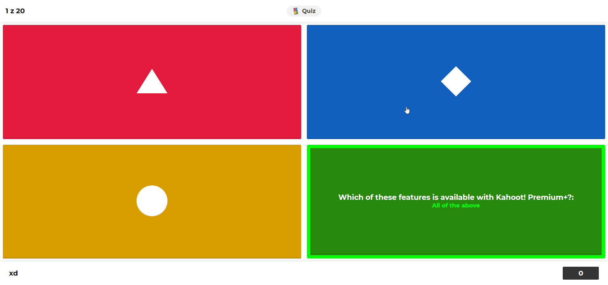

<br/>
<p align="center">
  <a href="https://github.com/pxtrez/Kaheet">
    
  </a>

  <h3 align="center">Kaheet</h3>

  <p align="center">
    The best free cheat for Kahoot
    <br/>
    <br/>
  </p>
</p>

    

# [HERE](https://pxtrez.com/) IS A CHEAT THAT WORKS FOR PRIVATE QUIZZES

## Table Of Contents

-   [Usage](#usage)
-   [Contributing](#contributing)
-   [License](#license)

## Usage

1. Join Kahoot
2. Open the console (`CTRL + SHIFT + J`) and paste the script:

```ts
fetch(
    "https://raw.githubusercontent.com/pxtrez/kaheet/main/dist/bundle.js"
).then((r) => r.text().then((t) => eval(t)));
```

3. Then enter the [quizID](#What-is-quizid)



### What is quizid

quizID is a string of random characters shown in the URL at the top of the teacher / host screen.


## Contributing

Contributions are what make the open source community such an amazing place to be learn, inspire, and create. Any contributions you make are greatly appreciated.

-   If you have suggestions for adding or removing projects, feel free to open an issue to discuss it, or directly create a pull request after you edit the README.md file with necessary changes.
-   Please make sure you check your spelling and grammar.

## License

Distributed under the GNU GPLv3 License. See [LICENSE](./LICENSE) for more information.
